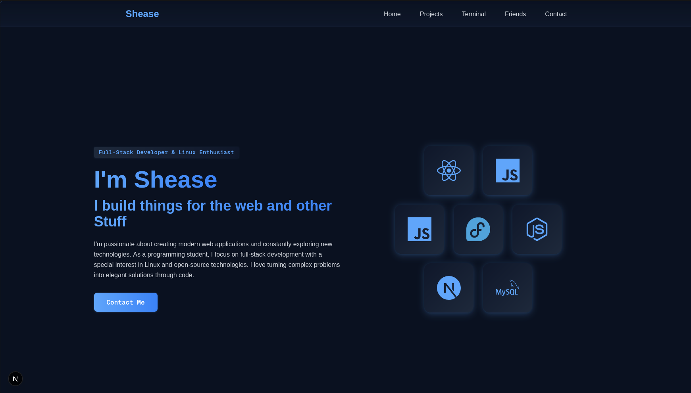

# Shease Portfolio

A modern, interactive portfolio website built with Next.js, featuring smooth animations, an interactive terminal, and responsive design.



## Features

- 🎨 Modern UI with Tailwind CSS and Framer Motion animations
- 💻 Interactive Terminal component with custom commands
- 📱 Fully responsive design
- 🚀 Fast page loads with Next.js
- 🔥 Real-time project showcase
- 👥 Friends & colleagues section
- 📧 Contact integration

## Tech Stack

- [Next.js](https://nextjs.org/) - React framework
- [Tailwind CSS](https://tailwindcss.com/) - Styling
- [Framer Motion](https://www.framer.com/motion/) - Animations
- [React Icons](https://react-icons.github.io/react-icons/) - Icons

## Getting Started

### Prerequisites

- Node.js 18+ 
- npm/yarn/pnpm

### Installation

1. Clone the repository
```bash
git clone https://github.com/lsheasel/about-me.git
cd about-me
```

2. Install dependencies
```bash
npm install
# or
yarn install
```

3. Start the development server
```bash
npm run dev
# or
yarn dev
```

4. Open [http://localhost:3000](http://localhost:3000) in your browser

## Terminal Commands

Try these commands in the interactive terminal:

- `help` - Show available commands
- `about` - Learn about me
- `skills` - View my technical skills
- `contact` - Get my contact information
- `ascii` - Display ASCII art logo
- `matrix` - Start Matrix animation
- `clear` - Clear terminal

## Project Structure

```
src/
├── app/              # Next.js app directory
├── components/       # React components
│   └── Terminal/    # Interactive terminal component
├── hooks/           # Custom React hooks
└── utils/           # Utility functions
```

## Contact

- Email: contact@shease.de
- Discord: shease.
- GitHub: [@lsheasel](https://github.com/lsheasel)

## License

This project is open source and available under the MIT License.

## Deployment

The site is deployed on [Vercel](https://vercel.com) and can be viewed at [shease.de](https://shease.de).
